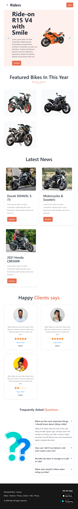

# Riders - Static Website

## Project Overview

Riders is a static website built using HTML5 and styled with Tailwind CSS. The project incorporates the Daisy UI components to enhance the user interface and experience. It is designed to showcase various sections including features of bikes, latest news, customer reviews, and frequently asked questions (FAQ).

## Technologies Used

- HTML5
- Tailwind CSS
- Daisu UI Components

## Sections

#### 1. Features of Bikes

#### 2. Latest News

#### 3. Customer Reviews

#### 4. FAQ (Frequently Asked Questions)

## Usage

1. **Clone the repository:**

   ```bash
   git clone https://github.com/Sadiqur057/Riders.git
   ```

## Screenshots

### Desktop View


### Tablet View



### Mobile View


